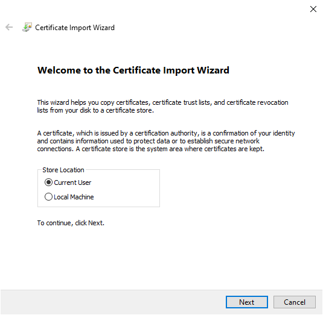
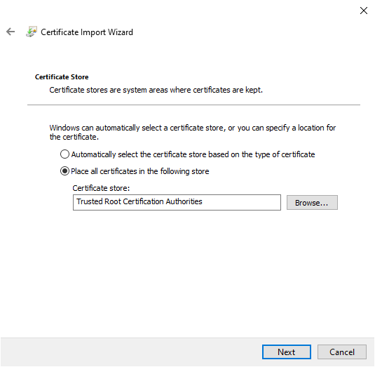

# TLS Server
---

## Creating a self-signed certificate
Many ways exists to reach the same goal, this is example is based on Linux and OpenSSL and creates not only a Server Certificate, but also a CA Certificate. An existing CA Certificate makes it easier for the Client PC trusts the Certificates as he only need to trust the CA Certificate and all Certificates signed by this CA (your own CA) are automatically trusted. This not only makes it easier for testing purposes but also if you need to create more Certificates

Create the following 3 files:

1. `ca.cnf` - ca certificate configuration

```cs
[req]
prompt = no
distinguished_name = req_distinguished_name

[req_distinguished_name]
C = AT
ST = MYSTATE
L = MYLOCALITY
O = MYORGANIZATION
```

2. `server.cnf` - server certificate configuration

```cs
[req]
default_bits = 2048
prompt = no
default_md = sha256
distinguished_name = req_distinguished_name

[req_distinguished_name]
C = AT
ST = MYSTATE
L = MYLOCALITY
O = MYORGANIZATION
CN = SCM20260D
```


3. `server_v3.ext` - server certificate extension

```cs
authorityKeyIdentifier=keyid,issuer
basicConstraints=CA:FALSE
keyUsage = digitalSignature, nonRepudiation, keyEncipherment, dataEncipherment
subjectAltName = @alt_names

[alt_names]
DNS.1 = SCM20260D
IP.1 = 192.168.0.109
```

The following steps produce a `ca.crt`(Certificate Authority) you can publish and import in your PC

1. edit `ca.cnf`
change the values for C, ST, L and O
2. Generate a CA private key
`$ openssl genrsa -out ca_privatekey.pem 2048`
3. Generate a 10 years valid CA certificate (from Linux Shell)
`$ openssl req -new -x509 -days 3650 -nodes -key ca_privatekey.pem -sha256 -out ca.crt -config ca.cnf`


The following steps produce 2 files named `serverkey.key` and `servercert.crt` you need to use in your device

1. edit server.cnf
change the values for C, ST, L and O
change the value of CN, with DNS the FQDN (server.exampledomain.local), NetBIOS Name (SERVER) or IP Address
2. edit server_v3.ext
change the values in alt_names section, important to have an entry for the CN value from before
important to include CN content from step before!
3. Create a Certificate Signing Request
`$ openssl req -new -nodes -out server.csr -keyout serverkey.key -config server.cnf`
4. Generate a 1 year valid self signed Server Certificate
`$ openssl x509 -req -in server.csr -CA ca.crt -CAkey ca_privatekey.pem -CAcreateserial -out servercert.crt -days 365 -extfile server_v3.ext`

### Importing the root certificate
 Install the CA Certificate in "Current User" Store Location and "Trusted Root Certification Authorities" Certificate store

1. Double click on `ca.crt` and click `Install Certificate..`


2. Make sure `Current User` is selected.



3. Select `Place all certificates in the following store`. Click `Browse...` and select `Trusted Root Certification Authorities`



From this moment your PC will trust all Certificates signed from your CA


### Removing a root certificate from a PC

1. Either run certmgr.msc or search for cert in Windows 10 Settings and select "Manage user certificates" to open Cert Manager for Current User, not for Local Computer


2. Select "Trusted Root Certification Authorities" and "Certificates", on the right side find your certificate based on the values from `ca.cnf`


This sample of code uses `X509Certificate`. Place the certificate inside the projects `Resources`

>[!TIP]
>Add using statement: System.Security.Cryptography.X509Certificates;

```cs
byte[] servercert = Resources.GetBytes(Resources.BinaryResources.servercert);

X509Certificate certificate = new X509Certificate(servercert){
    PrivateKey = Resources.GetBytes(Resources.BinaryResources.serverkey),
};
```

This sample of code uses `SslStream`

>[!TIP]
>Add using statements:
>using System.Net.Security &
>using System.Net.Sockets

```cs
Socket socket;
NetworkStream stream;
try{
    SslStream sslStream = new SslStream(socket);
    sslStream.AuthenticateAsServer(certificate, System.Security.Authentication.SslProtocols.Tls12);

    stream = sslStream;
}
catch (InvalidOperationException){
}
stream.Write(byte[]buffer,int offset, int count);
stream.Read(byte[]buffer, int offset, int count);

```

For further information on OpenSSL can be found [here.](https://www.openssl.org)